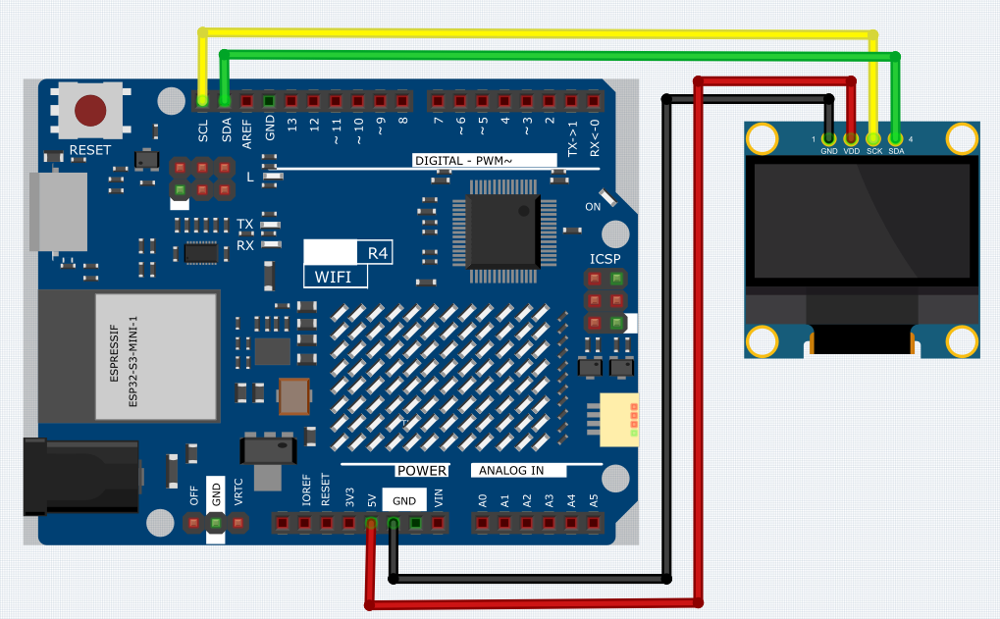

.. _Basic_0.96_inch_OLED:

0.96 inch IIC OLED
==========================

Overview
---------------

In this lesson, you will learn about OLED Displays using the SSD1306 driver. OLED (Organic Light-Emitting Diodes) displays are widely used in various electronic devices such as smartwatches, mobile phones, and even televisions. The SSD1306 is a single-chip CMOS OLED/PLED driver with controller for organic/polymer light emitting diode dot-matrix graphic display system. It offers a crisp and clear visual output through the means of organic material-based diodes that emit light when an electric current passes through them.

In the code provided, an OLED display is interfaced with an Arduino board via the I2C protocol. The code uses the Adafruit SSD1306 library to control the display. The program covers various functionalities such as:

1. Displaying text: "Hello world!" is printed on the screen.
2. Inverted text: The text "Hello world!" is displayed in an inverted color scheme.
3. Numerical Display: The numbers 123456789 are displayed.
4. ASCII Characters: A set of ASCII characters are displayed.
5. Font Size: The text "Hello!" is displayed with an increased font size.
6. Scrolling: Text is scrolled horizontally across the display.
7. Bitmap Display: A predefined bitmap image is displayed on the OLED screen.

This OLED display can be used in a multitude of applications including digital clocks, mini game consoles, information displays, and so on. It offers a great way to provide a user interface in compact and portable devices.

Wiring
----------------------

Schematic Diagram
-----------------------

.. 
   .. image:: img/0.96_inch_OLED_Wiring1.png
   :align: center
   :width: 70%

Code
---------------

.. note::

    * You can open the file ``14_IIC_OLED.ino`` under the path of ``Basic-Starter-Kit-for-Arduino-Uno-R4-WiFi-main\Code`` directly.
    * To install the library, use the Arduino Library Manager and search for **"Adafruit SSD1306"** and **"Adafruit GFX"** and install it.

Code Analysis
------------------------

1. **Library Inclusion and Initial Definitions**:
   The necessary libraries for interfacing with the OLED are included. Following that, definitions regarding the OLED's dimensions and I2C address are provided.

   - **Adafruit SSD1306**: This library is designed to help with the interfacing of the SSD1306 OLED display. It provides methods to initialize the display, control its settings, and display content.
   - **Adafruit GFX Library**: This is a core graphics library for displaying text, producing colors, drawing shapes, etc., on various screens including OLEDs.

   .. note:: 
      To install the library, use the Arduino Library Manager and search for **"Adafruit SSD1306"** and **"Adafruit GFX"** and install it. 

   .. code-block:: arduino
    
      #include <SPI.h>
      #include <Wire.h>
      #include <Adafruit_GFX.h>
      #include <Adafruit_SSD1306.h>

      #define SCREEN_WIDTH 128  // OLED display width, in pixels
      #define SCREEN_HEIGHT 64  // OLED display height, in pixels

      #define OLED_RESET -1
      #define SCREEN_ADDRESS 0x3C

2. **Bitmap Data**:
   Bitmap data for displaying a custom icon on the OLED screen. This data represents an image in a format that the OLED can interpret.

   You can use this online tool called `image2cpp <https://javl.github.io/image2cpp/>`_ that can turn your image into an array. 

   The ``PROGMEM`` keyword denotes that the array is stored in the program memory of the Arduino microcontroller. Storing data in program memory(PROGMEM) instead of RAM can be helpful for large amounts of data, which would otherwise take up too much space in RAM.

   .. code-block:: arduino

      static const unsigned char PROGMEM L_Icon[] = {...};

3. **Setup Function (Initialization and Display)**:
   The ``setup()`` function initializes the OLED and displays a series of patterns, texts, and animations.

   .. code-block:: arduino

      void setup() {
         ...  // Serial initialization and OLED object initialization
         ...  // Displaying various text, numbers, and animations
      }