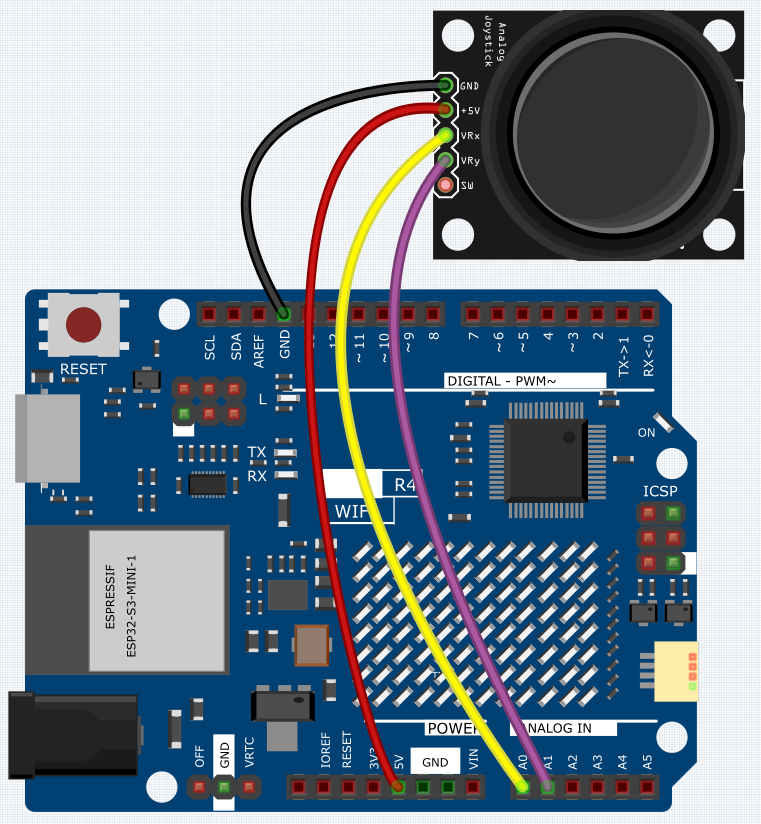
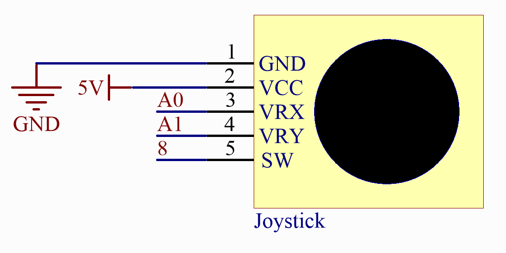

.. _Basic_Joystick_Module:

Joystick Module
==========================

Overview
---------------

A joystick is an input device consisting of a stick that pivots on a base and reports its angle or direction to the device it is controlling. Joysticks are often used to control video games and robots. A Joystick PS2 is used here.

Wiring
----------------------

Schematic Diagram
---------------------

This module has two analog outputs (corresponding to X,Y biaxial offsets). 

In this experiment, we use the Uno board to detect the moving direction of the Joystick knob.

Code
-------

.. note::

    * You can open the file ``10_Joystick_Module.ino`` under the path of ``Basic-Starter-Kit-for-Arduino-Uno-R4-WiFi-main\Code`` directly.

Now, when you push the rocker, the coordinates of the X and Y axes displayed on the Serial Monitor will change accordingly.

Code Analysis
-------------------

The code is use the serial monitor to print the value of the VRX and VRY pins of the joystick ps2.

.. code-block:: arduino

    void loop()
    {
        Serial.print("X: "); 
        Serial.print(analogRead(xPin), DEC);  // print the value of VRX in DEC
        Serial.print("|Y: ");
        Serial.print(analogRead(yPin), DEC);  // print the value of VRX in DEC
        delay(50);
    }