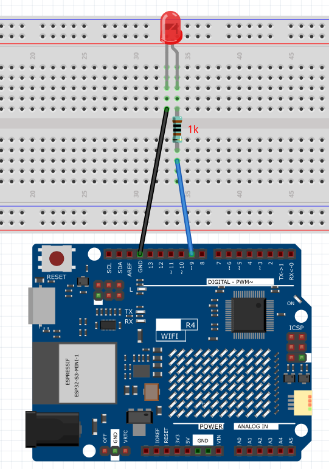

.. _Basic_LED_Blink:

LED Blink
==========================

Just as printing "Hello, world!" is the first step in learning to program, using a program to drive an LED is the traditional introduction to learning physical programming.

Wiring
----------------------

Schematic Diagram
-----------------------

.. 
   image:: img/Led_Blink_Wiring1.png (COMMENTED OUT - WEBP format)
   :align: center
   :width: 80%

Code
---------------

.. note::

    * You can open the file ``01_LED_Blink.ino`` under the path of ``Basic-Starter-Kit-for-Arduino-Uno-R4-WiFi-main\Code``. 

After the code is uploaded successfully, you will see the LED connected to digital pin 9 of the Arduino board start to blink. The LED will turn on for half a second and then turn off for another half a second, repeating this cycle continuously as the program runs.

Code Analysis
------------------------

Here, we connect the LED to the digital pin 9, so we need to declare an ``int`` variable called ``ledpin`` at the beginning of the program and assign a value of 9.

.. code-block:: arduino

    const int ledPin = 9;

Now, initialize the pin in the ``setup()`` function, where you need to initialize the pin to ``OUTPUT`` mode.

.. code-block:: arduino

    void setup() {
        pinMode(ledPin, OUTPUT);
    }

In ``loop()``, ``digitalWrite()`` is used to provide 5V high level signal for ledpin, which will cause voltage difference between LED pins and light LED up.

.. code-block:: arduino

    digitalWrite(ledPin, HIGH);

If the level signal is changed to LOW, the ledPin’s signal will be returned to 0 V to turn LED off.

.. code-block:: arduino

    digitalWrite(ledPin, LOW);

An interval between on and off is required to allow people to see the change, 
so we use a ``delay(1000)`` code to let the controller do nothing for 1000 ms.

.. code-block:: arduino

    delay(1000);