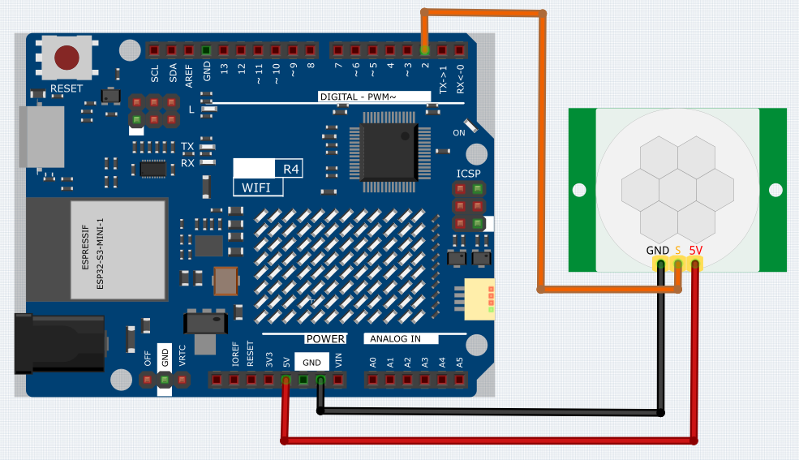

.. _Basic_PIR_Motion_Sensor:

PIR Motion Sensor Module
==========================

Overview
---------------

In this lesson, you will learn about PIR motion sensor module. The Passive Infrared(PIR) Motion Sensor is a sensor that detects motion. It is commonly used in security systems and automatic lighting systems. The sensor has two slots that detect infrared radiation. When an object, such as a person, passes in front of the sensor, it detects a change in the amount of infrared radiation and triggers an output signal.

Wiring
----------------------

Schematic Diagram
-----------------------

.. 
   .. image:: img/PIR_Wiring1.png
   :align: center
   :width: 50%

Code
---------------

.. note::

    * You can open the file ``12_PIR_Motion_Sensor.ino`` under the path of ``Basic-Starter-Kit-for-Arduino-Uno-R4-WiFi-main\Code`` directly.

After uploading the code to the Arduino Uno board, you can open the serial monitor to observe the sensor's output. When the PIR (passive infrared) motion sensor detects movement, the serial monitor will display the message "Somebody here!" to indicate that motion has been detected. If no motion is detected, the message "Monitoring..." will be shown instead.

The PIR sensor outputs a digital HIGH or LOW signal, corresponding to detected or undetected motion, respectively. Unlike an analog sensor that provides a range of values, the digital output from this PIR sensor will either be HIGH (typically represented as '1') or LOW (typically represented as '0').

Note that the actual sensitivity and range of detection can vary based on the PIR sensor's characteristics and the environmental conditions. Therefore, it is advisable to calibrate the sensor according to your specific needs.