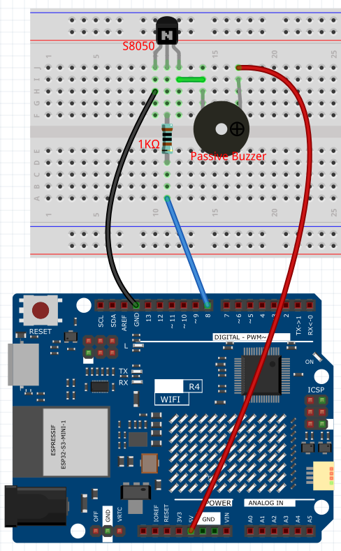
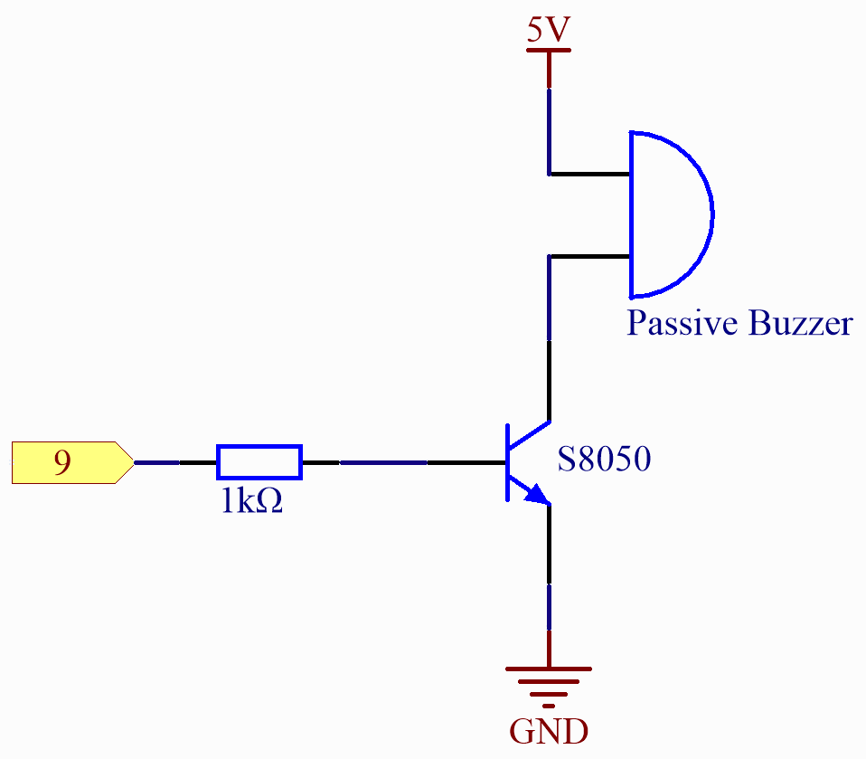

.. _Basic_Passive_Buzzer:

Passive Buzzer
==========================

Overview
---------------

In this project, use these two functions to make the passive buzzer vibrate and produce sound. The function ``tone()`` generates a square wave with a specified frequency (and 50% duty cycle) on a pin. A duration can be specified, or the wave continues until ``noTone()`` is called.
Similar to the active buzzer, the passive buzzer also utilizes electromagnetic induction to operate.
The difference is that a passive buzzer does not have its own oscillating source, so it will not emit sound if DC signals are used.However, this allows the passive buzzer to adjust its own oscillation frequency and produce different notes such as "do, re, mi, fa, sol, la, ti".

Wiring
----------------------

.. note::
    When connecting the buzzer, make sure to check its pins. The longer pin is the anode and the shorter one is the cathode. It's important not to mix them up, as doing so will prevent the buzzer from producing any sound.

Schematic Diagram
-----------------------

Code
---------------

.. note::

    * You can open the file ``05_Passive_Buzzer.ino`` under the path of ``Basic-Starter-Kit-for-Arduino-Uno-R4-WiFi-main\Code`` directly.

At the time when you finish uploading the codes to the R4 board, you can hear a melody containing seven notes. 

Code Analysis
------------------------

1. Including the pitches library:
   This library provides the frequency values for various musical notes, allowing you to use musical notation in your code.

   .. note::
      Please place the ``pitches.h`` file in the same directory as the code to ensure proper functioning. `pitches.h <https://raw.githubusercontent.com/lafvintech/Basic-Starter-Kit-for-Arduino-Uno-R4-WiFi/main/Code/05_Passive_Buzzer/pitches.h>`_

      .. image:: img/Passive_Buzzer_Code.png

   .. code-block:: arduino
       
      #include "pitches.h"

2. Defining constants and arrays:

   * ``buzzerPin`` is the digital pin on the Arduino where the buzzer is connected.

   * ``melody[]`` is an array that stores the sequence of notes to be played.

   * ``noteDurations[]`` is an array that stores the duration of each note in the melody.

   .. code-block:: arduino
   
      const int buzzerPin = 8;
      int melody[] = {
        NOTE_C4, NOTE_G3, NOTE_G3, NOTE_A3, NOTE_G3, 0, NOTE_B3, NOTE_C4
      };
      int noteDurations[] = {
        4, 8, 8, 4, 4, 4, 4, 4
      };

3. Playing the melody:

   * The ``for`` loop iterates over each note in the melody.

   * The ``tone()`` function plays a note on the buzzer for a specific duration.

   * A delay is added between notes to distinguish them.

   * The ``noTone()`` function stops the sound.

   .. code-block:: arduino
   
      void setup() {
        for (int thisNote = 0; thisNote < 8; thisNote++) {
          int noteDuration = 1000 / noteDurations[thisNote];
          tone(buzzerPin, melody[thisNote], noteDuration);
          int pauseBetweenNotes = noteDuration * 1.30;
          delay(pauseBetweenNotes);
          noTone(buzzerPin);
        }
      }

4. Empty loop function:
   Since the melody is played only once in the setup, there's no code in the loop function.

5. Feel free to experiment with altering the notes and durations in the ``melody[]`` and ``noteDurations[]`` arrays to create your own melodies. If you're interested, there is a GitHub repository (`arduino-songs <https://github.com/robsoncouto/arduino-songs>`_) that offers Arduino code for playing various songs. While their approach may differ from this project, you can consult their notes and durations for reference.