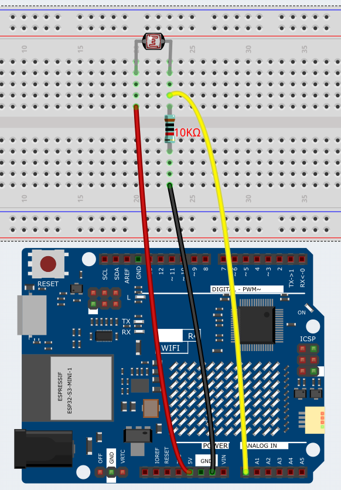
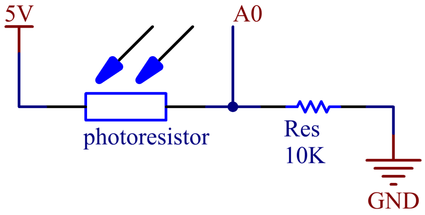

.. _Basic_Photoresistor:

Photoresistor
==========================

Overview
---------------

In this lesson, you will learn about Photoresistor. Photoresistor is applied in many electronic goods, such as the camera meter, clock radio, alarm device (as beam detector), small night lights, outdoor clock, solar street lamps and etc. Photoresistor is placed in a street lamp to control when the light is turned on. Ambient light falling on the photoresistor causes street lamps to turn on or off.

Wiring
----------------------

In this example, we use analog pin ( A0 ) to read the value of photoresistor. One pin of photoresistor is connected to 5V, the other is wired up to A0. Besides, a 10kΩ resistor is needed before the other pin is connected to GND.

Schematic Diagram
-----------------------

Code
---------------

.. note::

    * You can open the file ``06_Photoresistor.ino`` under the path of ``Basic-Starter-Kit-for-Arduino-Uno-R4-WiFi-main\Code`` directly.

After uploading the codes to the uno board, you can open the serial monitor to see the read value of the pin. When the ambient light becomes stronger, the reading will increase correspondingly, and the pin reading range is 「0」~「1023」.  However, according to the environmental conditions and the characteristics of the photoresistor, the actual reading range may be smaller than the theoretical range.