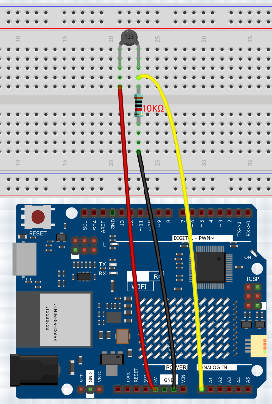

.. _Basic_Thermistor:

Thermistor
==========================

Overview
-------------

In this lesson, you will learn how to use thermistor. Thermistor can be used as electronic circuit components for temperature compensation of instrument circuits. In the current meter, flowmeter, gas analyzer, and other devices. It can also be used for overheating protection, contactless relay, constant temperature, automatic gain control, motor start, time delay, color TV automatic degaussing, fire alarm and temperature compensation.

Wiring
----------------------

In this example, we use the analog pin A0 to get the value of Thermistor. One pin of thermistor is connected to 5V, and the other is wired up to A0. At the same time, a 10kΩ resistor is connected with the other pin before connecting to GND.

Schematic Diagram
-----------------------

.. 
   image:: img/Thermistor_Wiring1.png (COMMENTED OUT - WEBP format)
   :align: center
   :width: 70%

Code
-----------

.. note::

    * You can open the file ``07_Thermistor.ino`` under the path of ``Basic-Starter-Kit-for-Arduino-Uno-R4-WiFi-main\Code`` directly.

After uploading the code to the uno r4 board, you can open the serial monitor to check the current temperature. 

The Kelvin temperature is calculated using the formula **T\ K\ =1/(ln(R\ T/R\ N)/B+1/T\ N)**. This equation is derived from the `steinhart_hart <https://en.wikipedia.org/wiki/Steinhart%E2%80%93Hart_equation>`_  and simplifies calculations. You can also find more information about this formula on the detailed introduction page of the :ref:`component_thermistor`.