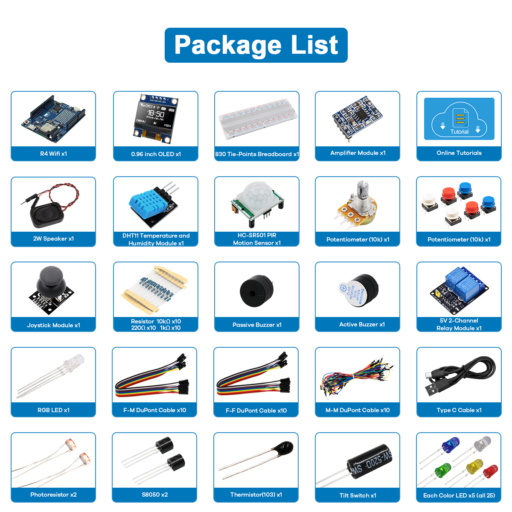

Components Introduction
=========================================

Below is the introduction to each component, which contains the operating principle of the component and the corresponding projects.

.. toctree::
    :maxdepth: 1

    component_UNO_R4
    component_breadboard
    component_wires
    component_resistor
    component_led
    component_rgb_led
    component_transistor
    component_buzzer
    component_button
    component_potentiometer
    component_photoresistor
    component_thermistor
    component_tilt_switch
    component_audio_speaker
    component_relay
    Components_joystick_module
    component_pir
    component_humiture_sensor
    component_oled

