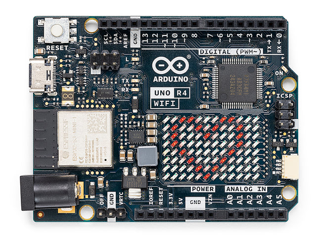
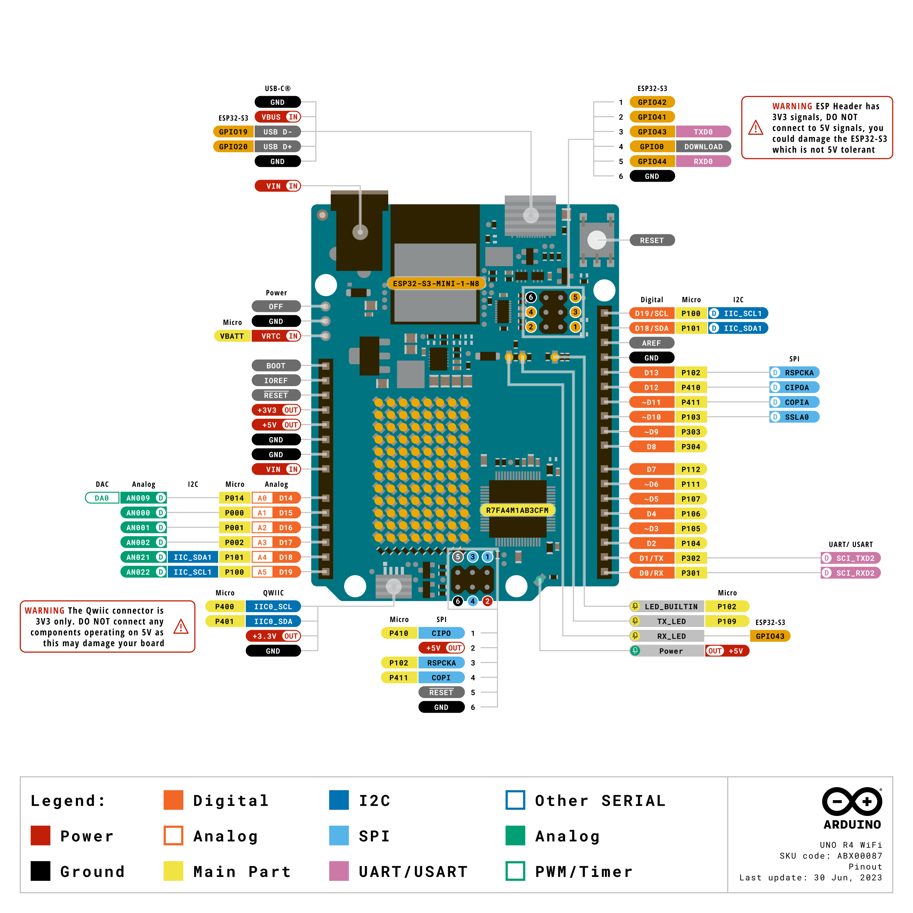

.. _Components_uno_r4_wifi:

Arduino Uno R4 WiFi
=================================

**Overview**

The Arduino UNO R4 WiFi stands at the forefront of IoT and wireless technology. It features the powerful RA4M1 microcontroller from Renesas, complemented by an ESP32-S3 coprocessor, making it an ideal choice for today’s innovative creators. This board is designed to cater to both beginners and experienced enthusiasts, delivering exceptional performance while preserving the familiar form factor and 5 V operating voltage of its predecessors.

As you explore the Arduino landscape, the UNO R4 WiFi exemplifies connectivity, efficiency, and creativity.

Here's what the Arduino UNO R4 WiFi offers:

* **Seamless Integration with UNO Ecosystem:** Staying true to its heritage, the UNO R4 WiFi guarantees compatibility with the iconic UNO form factor, pinout, and 5 V operating voltage. Transitioning from previous versions is effortless, thanks to the harmonious design and the expansive Arduino UNO ecosystem.
* **Supercharged Memory and Processing:** Step into a realm of faster computations and intricate projects. The UNO R4 WiFi not only boasts enhanced memory but also operates with a clock speed that's three times quicker, ensuring your projects run smoothly and efficiently.
* **Diverse On-Board Peripherals:** From a 12-bit DAC and CAN BUS to an OP AMP and a unique SWD port, the UNO R4 WiFi is equipped with features that elevate your project capabilities. Dive into a realm of endless possibilities and unleash your creativity.
* **Connectivity at its Best:** With integrated Wi-Fi® and Bluetooth® Low Energy, the UNO R4 WiFi paves the way to the Internet of Things. Whether crafting a smart home system or an interactive dashboard, this board has your back.
* **Interactive 12×8 LED Matrix:** Illuminate your projects with dynamic animations or real-time sensor data visualization, all without the need for external hardware.
* **Advanced Safety Mechanisms:** The board's innate ability to detect and prevent potentially harmful operations, such as division by zero, ensures a seamless experience. Plus, with detailed feedback on the serial monitor, you're always in the loop.
* **Qwiic Connector for Rapid Prototyping:** Broaden your project scope with the Qwiic connector. With a vast range of I2C-compatible modules available, prototyping becomes a breeze.

Step into the future of making with the Arduino UNO R4 WiFi. Whether you're aiming to integrate wireless functionalities, explore the vast IoT landscape, or simply upgrade your existing setup, this board is the ideal partner for your upcoming ventures.

**Tech specs**

+-----------------+---------------------------+-------------------------+
| Board           | Name                      | Arduino® UNO R4 WiFi    |
+=================+===========================+=========================+
| Microcontroller | Renesas RA4M1 (Arm® Cortex®-M4)                     |
+-----------------+---------------------------+-------------------------+
| USB             | USB-C®                    | Programming Port        |
+-----------------+---------------------------+-------------------------+
| Pins            | Digital I/O Pins          | 14                      |
+-----------------+---------------------------+-------------------------+
| Pins            | Analog input pins         | 6                       |
|                 +---------------------------+-------------------------+
|                 | DAC                       | 1                       |
|                 +---------------------------+-------------------------+
|                 | PWM pins                  | 6                       |
+-----------------+---------------------------+-------------------------+
| Communication   | UART                      | Yes, 1x                 |
|                 +---------------------------+-------------------------+
|                 | I2C                       | Yes, 1x                 |
|                 +---------------------------+-------------------------+
|                 | SPI                       | Yes, 1x                 |
|                 +---------------------------+-------------------------+
|                 | CAN                       | Yes 1 CAN Bus           |
+-----------------+---------------------------+-------------------------+
| Power           | Circuit operating voltage | 5 V (ESP32-S3 is 3.3 V) |
|                 +---------------------------+-------------------------+
|                 | Input voltage (VIN)       | 6-24 V                  |
|                 +---------------------------+-------------------------+
|                 | DC Current per I/O Pin    | 8 mA                    |
+-----------------+---------------------------+-------------------------+
| Clock speed     | Main core                 | 48 MHz                  |
|                 +---------------------------+-------------------------+
|                 | ESP32-S3                  | up to 240 MHz           |
+-----------------+---------------------------+-------------------------+
| Memory          | RA4M1                     | 256 kB Flash, 32 kB RAM |
|                 +---------------------------+-------------------------+
|                 | ESP32-S3                  | 384 kB ROM, 512 kB SRAM |
+-----------------+---------------------------+-------------------------+
| Dimensions      | Width                     | 68.85 mm                |
|                 +---------------------------+-------------------------+
|                 | Length                    | 53.34 mm                |
+-----------------+---------------------------+-------------------------+

**Pinout**

* `Arduino UNO R4 WiFi Datasheet <https://docs.arduino.cc/resources/datasheets/ABX00087-datasheet.pdf>`_
* `Arduino UNO R4 WiFi Schematic <https://docs.arduino.cc/resources/schematics/ABX00087-schematics.pdf>`_
* `Arduino UNO R4 WiFi Documentation <https://docs.arduino.cc/hardware/uno-r4-wifi>`_
* `Arduino UNO R4 WiFi Cheat Sheet <https://docs.arduino.cc/tutorials/uno-r4-wifi/cheat-sheet>`_
