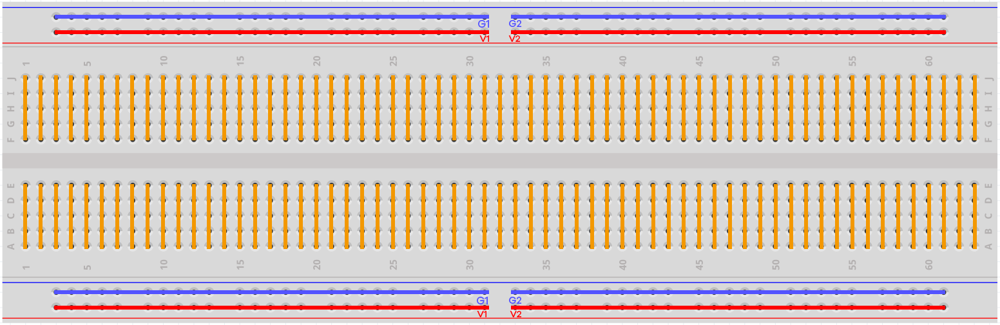

.. _cpn_breadboard:

Breadboard
==============

.. image:: img/breadboard.png
    :width: 600

A breadboard is a construction base for prototyping of electronics. Originally the word referred to a literal bread board, a polished piece of wood used for slicing bread. In the 1970s the solderless breadboard (a.k.a. plugboard, a terminal array board) became available and nowadays the term "breadboard" is commonly used to refer to these.

It is used to build and test circuits quickly before finishing any circuit design. 
And it has many holes into which components mentioned above can be inserted like ICs and resistors as well as jumper wires. 
The breadboard allows you to plug in and remove components easily. 

The picture shows the internal structure of a breadboard. 
Although these holes on the breadboard appear to be independent of each other, they are actually connected to each other through metal strips internally.

.. note:: 
    G1 and G2, V1 and V2 in the breadboard are not connected. Usually you need to use jumper wires to connect them.

.. image:: img/breadboard_internal1.png
    :align: center
    :width: 85%

If you want to know more about breadboard, refer to: `How to Use a Breadboard for Electronics and Circuits <https://www.sciencebuddies.org/science-fair-projects/references/how-to-use-a-breadboard>`_
