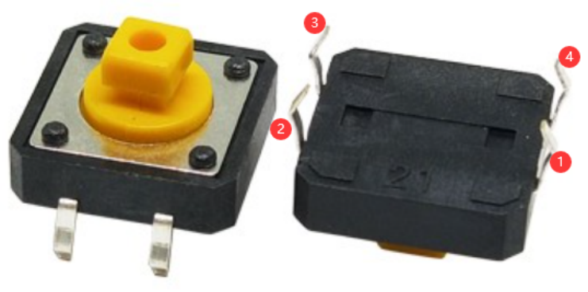
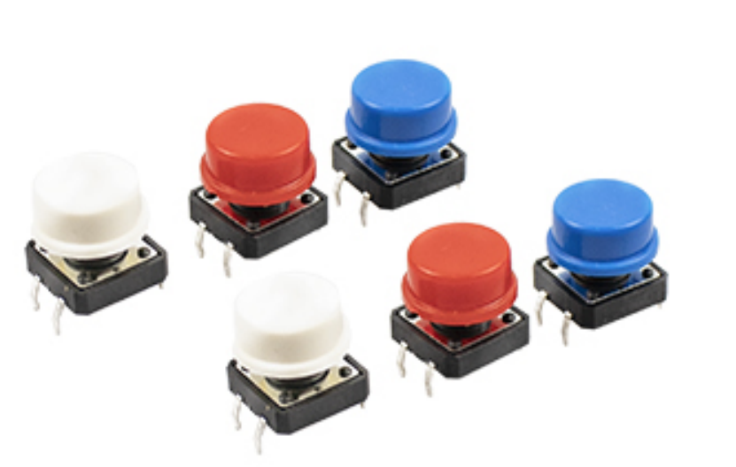

.. _cpn_button:

Button
==========

Buttons are essential components used to control electronic devices, typically functioning as switches to either complete or interrupt circuits. Despite their variety in sizes and shapes, the 6mm mini-button depicted in the accompanying images is our focus here. Within this button, pin 1 is connected to pin 2, and pin 3 is connected to pin 4. Therefore, you only need to establish a connection between pin 1 (or pin 2) and pin 3 (or pin 4) to operate it.

The internal structure of such a button is illustrated below. The symbol shown on the right is commonly used to represent a button in circuit diagrams.

.. image:: img/button_symbol.png
    :width: 400
    :align: center

Since the pin 1 is connected to pin 2, and pin 3 to pin 4, when the button is pressed, the 4 pins are connected, thus closing the circuit.

In this kit, we provide two types of buttons. The one mentioned earlier is a small button, and there is also a large button. They have the same principle, only different in size.

**Example**

* :ref:`Basic_Button_LED` (Basic Project)
* :ref:`Ext_Ping-Pong_Game` (Extension_Project)

