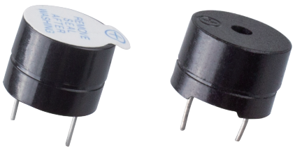

.. _cpn_buzzer:

Buzzer
=======

Electronic buzzers, featuring a compact design, are versatile components powered by direct current (DC) and are commonly found across a variety of electronic devices. They serve as auditory indicators in applications such as computers, printers, photocopiers, security systems, electronic playthings, vehicular electronics, telephones, and timing devices, among others.

Classification of buzzers is based on their functionality, distinguishing between active and passive types (as illustrated in the accompanying diagram). When you position the buzzer with its terminals facing upwards, the one featuring a green printed circuit board is identified as a passive type, whereas the one with an outer layer of black tape is classified as an active buzzer.

The operational distinction between active and passive buzzers is characterized by their internal circuitry and activation requirements:

- **Active Buzzers** are self-contained, featuring an integrated oscillating circuit that produces sound immediately when powered by DC. Their design eliminates the need for external signal modulation to generate audible tones.

- **Passive Buzzers** lack an internal oscillating circuit, and thus, are non-responsive to DC signals in terms of sound output. To induce sound from a passive buzzer, a specific frequency range of square wave signals, typically between 2 kHz and 5 kHz, must be supplied.

The presence of these internal oscillating circuits in active buzzers contributes to their higher cost in comparison to passive models, which require additional circuitry for sound emission.

Regarding the schematic representation, a buzzer is depicted with a simple symbol that includes two terminals to differentiate the positive and negative poles. The terminal indicated with a "+" is recognized as the anode, while its counterpart is identified as the cathode, guiding the correct orientation during circuit assembly.

.. image:: img/buzzer_symbol.png
    :width: 150

You can check the pins of the buzzer, the longer one is the anode and the shorter one is the cathode. Please don’t mix them up when connecting, otherwise the buzzer will not make sound. 

`Buzzer Wiki <https://en.wikipedia.org/wiki/Buzzer>`_

**Example**

* :ref:`Basic_Active_Buzzer` (Basic Project)
* :ref:`Basic_Passive_Buzzer` (Basic Project)
