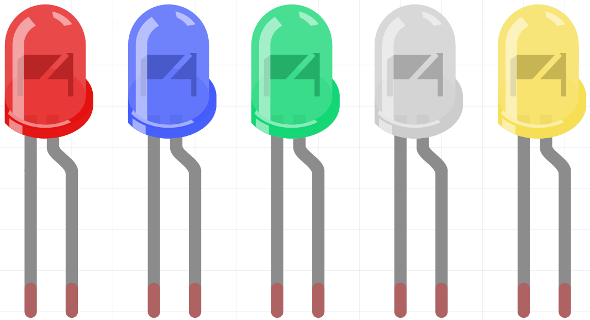

.. _cpn_led:

LED
==========

A semiconductor light-emitting diode (LED) is a component that converts electrical energy into light energy through PN junctions. LEDs can be classified by wavelength into laser diodes, infrared LEDs, and visible LEDs, the latter being commonly referred to simply as LEDs.

Due to the diode's unidirectional conductivity, current flows in the direction of the arrow shown in its circuit symbol. To illuminate the LED, you must supply positive voltage to the anode and negative voltage to the cathode.

.. image:: img/led_symbol.png

An LED has two pins. The longer one is the anode, and shorter one, the cathode. Pay attention not to connect them inversely. There is fixed forward voltage drop in the LED, so it cannot be connected with the circuit directly because the supply voltage can outweigh this drop and cause the LED to be burnt. The forward voltage of the red, yellow, and green LED is 1.8 V and that of the white one is 2.6 V. Most LEDs can withstand a maximum current of 20 mA, so we need to connect a current limiting resistor in series.                   

The formula of the resistance value is as follows:

    R = (Vsupply – VD)/I

**R** stands for the resistance value of the current limiting resistor, **Vsupply** for voltage supply, **VD** for voltage drop and **I** for the working current of the LED.

Here is the detailed introduction for the LED: `led_wiki <https://en.wikipedia.org/wiki/Light-emitting_diode>`_.

**Example**

* :ref:`Basic_LED_Blink` (Basic Project)
* :ref:`Basic_Button_LED` (Basic Project)
* :ref:`Basic_2_Channel_Relay_Module` (Basic Project)

