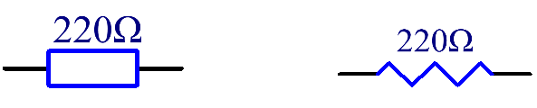

.. _component_resistor:

Resistor
============

.. image:: img/resistor.png
    :width: 300

A resistor is an electronic component that restricts the flow of current in a circuit. A fixed resistor has a set resistance value that cannot be altered, whereas a potentiometer or variable resistor has an adjustable resistance.

There are two commonly used symbols to represent resistors in circuit diagrams. The resistance value is typically indicated on the resistor itself. When you encounter these symbols in a circuit schematic, they denote a resistor.

**Ω** is the unit of resistance and the larger units include KΩ, MΩ, etc. 
Their relationship can be shown as follows: 1 MΩ=1000 KΩ, 1 KΩ = 1000 Ω. Normally, the value of resistance is marked on it. 

When using a resistor, we need to know its resistance first. Here are two methods: you can observe the bands on the resistor, or use a multimeter to measure the resistance. You are recommended to use the first method as it is more convenient and faster. 

.. image:: img/resistance_card.jpg

As shown in the card, each color stands for a number. 

.. list-table::

   * - Black
     - Brown
     - Red
     - Orange
     - Yellow
     - Green
     - Blue
     - Violet
     - Grey
     - White
     - Gold
     - Silver
   * - 0
     - 1
     - 2
     - 3
     - 4
     - 5
     - 6
     - 7
     - 8
     - 9
     - 0.1
     - 0.01

The 4- and 5-band resistors are frequently used, on which there are 4 and 5 chromatic bands. 

Normally, when you get a resistor, you may find it hard to decide which end to start for reading the color. 
The tip is that the gap between the 4th and 5th band will be comparatively larger.

Therefore, you can observe the gap between the two chromatic bands at one end of the resistor; 
if it's larger than any other band gaps, then you can read from the opposite side. 

Let’s see how to read the resistance value of a 5-band resistor as shown below.

.. image:: img/220ohm.jpg
    :width: 500

So for this resistor, the resistance should be read from left to right. 
The value should be in this format: 1st Band 2nd Band 3rd Band x 10^Multiplier (Ω) and the permissible error is ±Tolerance%. 
So the resistance value of this resistor is 2(red) 2(red) 0(black) x 10^0(black) Ω = 220 Ω, 
and the permissible error is ± 1% (brown). 

.. list-table::Common resistor color band
    :header-rows: 1

    * - Resistor 
      - Color Band  
    * - 10Ω   
      - brown black black silver brown
    * - 100Ω   
      - brown black black black brown
    * - 220Ω 
      - red red black black brown
    * - 330Ω 
      - orange orange black black brown
    * - 1kΩ 
      - brown black black brown brown
    * - 2kΩ 
      - red black black brown brown
    * - 5.1kΩ 
      - green brown black brown brown
    * - 10kΩ 
      - brown black black red brown 
    * - 100kΩ 
      - brown black black orange brown 
    * - 1MΩ 
      - brown black black green brown 

You can learn more about resistor from Wiki: `Resistor - Wikipedia <https://en.wikipedia.org/wiki/Resistor>`_.
