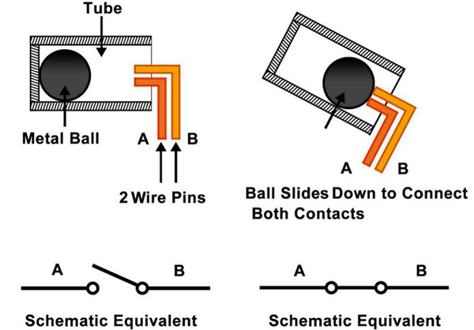

.. _cpn_tilt_switch:

Tilt Switch
=============================

.. image:: img/tilt_switch.png
    :width: 80
    :align: center

The tilt switch used here is a ball-type switch containing a metal ball inside. It is designed to detect slight inclinations.

The operating principle is straightforward. When the switch is tilted at a specific angle, the internal ball rolls and makes contact with the two terminals connected to the external pins, thereby completing the circuit. If the switch is not tilted, the ball stays away from the contacts, breaking the circuit.

**Example**

* :ref:`Ext_Digital_Dice_LED_Matrix` (Extension_Project)
