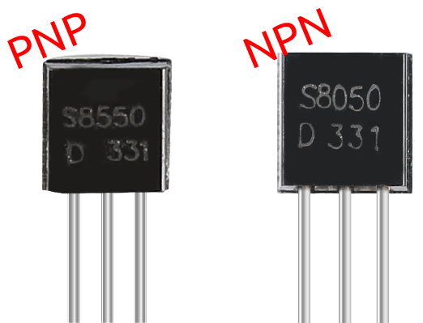
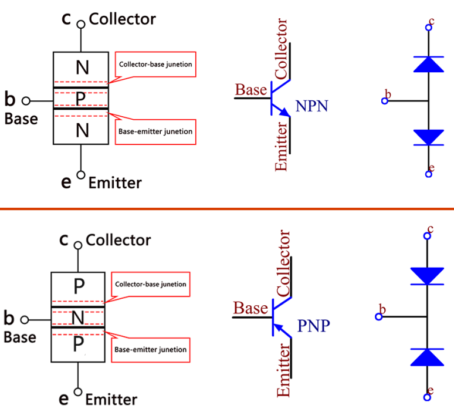

.. _cpn_transistor:

Transistor
============

A transistor is a semiconductor device that regulates current by using another current. It amplifies weak signals into stronger ones and can also serve as a non-contact switch.

A transistor consists of a three-layer structure made of P-type and N-type semiconductors, creating three distinct regions. The thin middle layer is the base region, while the other two layers are either N-type or P-type semiconductors. The region with a high concentration of majority carriers is the emitter region, and the other region is the collector. This structure allows the transistor to function as an amplifier. The three regions correspond to three terminals: the base (b), emitter (e), and collector (c). These regions form two P-N junctions, known as the emitter junction and the collector junction. The arrow in the transistor circuit symbol indicates the direction of the emitter junction.

* `P–N junction - Wikipedia <https://en.wikipedia.org/wiki/P-n_junction>`_

Based on the semiconductor type, transistors can be divided into two groups, the NPN and PNP ones. From the abbreviation, we can tell that the former is made of two N-type semiconductors and one P-type and that the latter is the opposite. See the figure below. 

.. note::
    s8550 is PNP transistor and the s8050 is the NPN one, They look very similar, and we need to check carefully to see their labels.

When a High level signal goes through an NPN transistor, it is energized. But a PNP one needs a Low level signal to manage it. Both types of transistor are frequently used for contactless switches, just like in this experiment.

Put the label side facing us and the pins facing down. The pins from left to right are emitter(e), base(b), and collector(c).

.. image:: img/ebc.png
    :width: 150

* `S8050 Transistor Datasheet <https://datasheet4u.com/datasheet-pdf/WeitronTechnology/S8050/pdf.php?id=576670>`_
* `S8550 Transistor Datasheet <https://www.mouser.com/datasheet/2/149/SS8550-118608.pdf>`_

**Example**

* :ref:`Basic_Active_Buzzer` (Basic Project)
* :ref:`Basic_Passive_Buzzer` (Basic Project)

