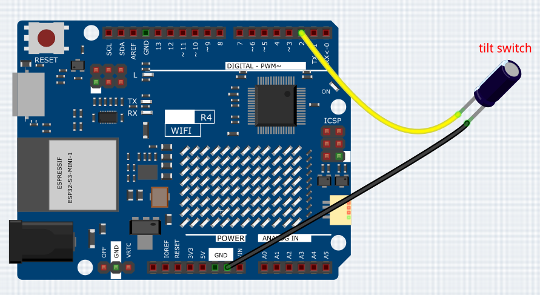

.. _Ext_Digital_Dice_LED_Matrix:

Digital Dice LED Matrix
=======================================

This project is designed to simulate dice rolling using LED Matrix. The dice rolling simulation can be activated by directly shaking the tilt switch. When this is done, the LED Matrix cycles through random numbers between 1 and 6, simulating the roll of a die. After a short interval, the LED Matrix stops and displays a random number representing the result of the dice roll.

Wiring
----------------------

.. raw:: html

    

Code
----------------------

.. note::

    * You can open the file ``19_Digital_Dice_LED_Matrix.ino`` under the path of ``Basic-Starter-Kit-for-Arduino-Uno-R4-WiFi-main\Code`` directly.

Code explanation
----------------------

#. Importing Required Library

   Import the ``Arduino_LED_Matrix`` library to control the LED matrix.

   .. code-block:: arduino

     #include <Arduino_LED_Matrix.h>

#. Variable Declarations

   Declare an instance of ``ArduinoLEDMatrix`` and variables for tilt switch and rolling state.

   .. code-block:: arduino

     ArduinoLEDMatrix matrix;
     const int tiltPin = 2;
     volatile bool rolling = false;
     unsigned long lastShakeTime = 0;

#. Pre-defined 2D Arrays

   Define 2D arrays representing frames to be displayed on the LED matrix.

   .. code-block:: arduino

     byte frame[8][12] = { ... };
     byte one[8][12] = { ... };
     byte two[8][12] = { ... };
     byte three[8][12] = { ... };
     byte four[8][12] = { ... };
     byte five[8][12] = { ... };
     byte six[8][12] = { ... };

#. Pre-defined Bitmap

   Define a pre-loaded frame for initializing the matrix.

   .. code-block:: arduino

     const uint32_t hi[] = {
       0xcdfcdfcc,
       0x4fc4fc4c,
       0xc4cdfcdf,
       66
     };

#. Display Number Function

   Function to display a specific number on the LED matrix.

   .. code-block:: arduino

     void display_number(byte number) {
       if (number == 1) { matrix.renderBitmap(one, 8, 12); }
       else if (number == 2) { matrix.renderBitmap(two, 8, 12); }
       else if (number == 3) { matrix.renderBitmap(three, 8, 12); }
       else if (number == 4) { matrix.renderBitmap(four, 8, 12); }
       else if (number == 5) { matrix.renderBitmap(five, 8, 12); }
       else if (number == 6) { matrix.renderBitmap(six, 8, 12); }
       else { matrix.renderBitmap(frame, 8, 12); }
     }

#. Setup Function

   Initialize the LED matrix and configure the tilt switch.

   .. code-block:: arduino

     void setup() {
       matrix.begin();
       pinMode(tiltPin, INPUT_PULLUP);
       attachInterrupt(digitalPinToInterrupt(tiltPin), rollDice, CHANGE);
       matrix.loadFrame(hi);
     }

#. Main Loop

   Main loop to check if the dice is rolling and display a random number.

   .. code-block:: arduino

     void loop() {
       if (rolling) {
         byte number = random(1, 7);
         display_number(number);
         delay(80);
         if ((millis() - lastShakeTime) > 1000) {
           rolling = false;
         }
       }
     }

#. Interrupt Handler

   Interrupt handler to detect tilt and start rolling the dice.

   .. code-block:: arduino

     void rollDice() {
       if (digitalRead(tiltPin) == LOW) {
         lastShakeTime = millis();
         rolling = true;
       }
     }
