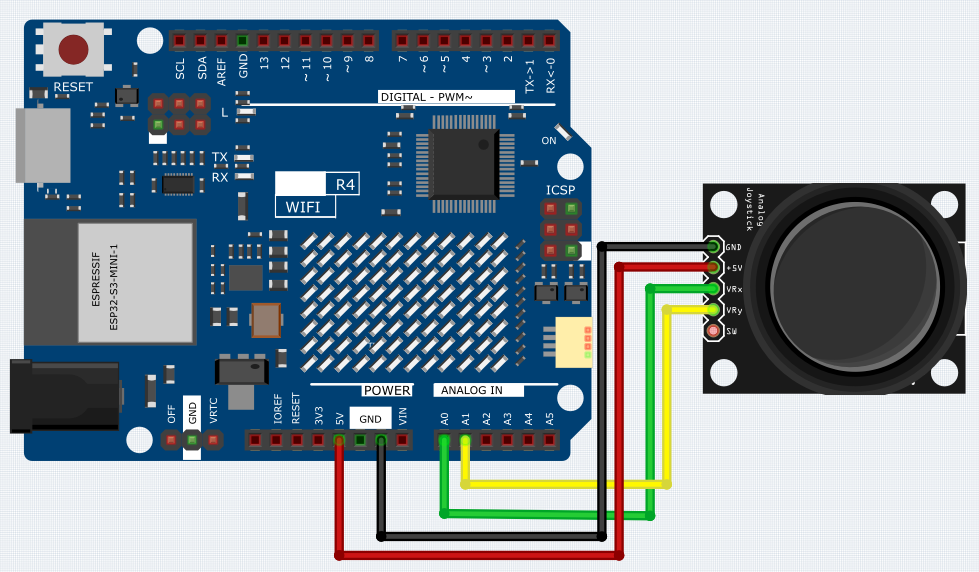

.. _Ext_Greedy_Snake_Game:

Greedy Snake Game
=========================

This example implements the classic Snake game on an 8x12 LED matrix using the R4 Wifi board.
Players control the snake's direction using a dual-axis joystick.

Wiring
-----------------

**Schematic**

.. 
   image:: img/Greedy_Snake_Game_Wiring1.png (COMMENTED OUT - WEBP format)
   :width: 80%
   :align: center

Code
-----------------
.. note::

    * You can open the file ``20_Greedy_Snake_Game.ino`` under the path of ``Basic-Starter-Kit-for-Arduino-Uno-R4-WiFi-main\Code`` directly.

How it works?
-----------------
#. Include Libraries

   Include the necessary library for the LED matrix.

   .. code-block:: arduino

     #include "Arduino_LED_Matrix.h"

#. Initialize Variables

   Define and initialize variables for the LED matrix, snake, and food.

   .. code-block:: arduino

     ArduinoLEDMatrix matrix;
     byte frame[8][12];
     byte flatFrame[8 * 12];

     struct Point {
       byte x;
       byte y;
     };

     Point snake[100];
     int snakeLength = 3;
     Point food;
     int direction = 0;

#. Setup Function

   Initialize the joystick and LED matrix. Set initial snake position and generate food.

   .. code-block:: arduino

     void setup() {
       pinMode(A0, INPUT);
       pinMode(A1, INPUT);

       matrix.begin();

       snake[0] = { 6, 4 };
       snake[1] = { 6, 5 };
       snake[2] = { 6, 6 };

       generateFood();
     }

#. Main Loop

   Read joystick input, update snake direction, move snake, check for collisions, and update the display.

   .. code-block:: arduino

     void loop() {
       int x = analogRead(A0);
       int y = analogRead(A1);

       if (x > 600 && direction != 3) direction = 1;
       else if (x < 400 && direction != 1) direction = 3;
       else if (y > 600 && direction != 0) direction = 2;
       else if (y < 400 && direction != 2) direction = 0;

       moveSnake();

       if (snake[0].x == food.x && snake[0].y == food.y) {
         snake[snakeLength] = snake[snakeLength - 1];
         snakeLength++;
         generateFood();
       }

       for (int i = 1; i < snakeLength; i++) {
         if (snake[0].x == snake[i].x && snake[0].y == snake[i].y) {
           snakeLength = 3;
           snake[0] = { 6, 4 };
           snake[1] = { 6, 5 };
           snake[2] = { 6, 6 };
           direction = 0;
           generateFood();
         }
       }

       drawFrame();
       delay(200);
     }

#. Move Snake

   Update the snake's position based on the direction.

   .. code-block:: arduino

     void moveSnake() {
       for (int i = snakeLength - 1; i > 0; i--) {
         snake[i] = snake[i - 1];
       }

       switch (direction) {
         case 0:
           snake[0].y = (snake[0].y - 1 + 8) % 8;
           break;
         case 1:
           snake[0].x = (snake[0].x + 1) % 12;
           break;
         case 2:
           snake[0].y = (snake[0].y + 1) % 8;
           break;
         case 3:
           snake[0].x = (snake[0].x - 1 + 12) % 12;
           break;
       }
     }

#. Generate Food

   Generate a new food position that doesn't overlap with the snake.

   .. code-block:: arduino

     void generateFood() {
       Point possibleLocations[8 * 12];
       int idx = 0;

       for (int y = 0; y < 8; y++) {
         for (int x = 0; x < 12; x++) {
           bool overlap = false;

           for (int i = 0; i < snakeLength; i++) {
             if (snake[i].x == x && snake[i].y == y) {
               overlap = true;
               break;
             }
           }

           if (!overlap) {
             possibleLocations[idx++] = { x, y };
           }
         }
       }

       int choice = random(0, idx);
       food = possibleLocations[choice];
     }

#. Draw Frame

   Draw the current state of the snake and food on the LED matrix.

   .. code-block:: arduino

     void drawFrame() {
       for (int y = 0; y < 8; y++) {
         for (int x = 0; x < 12; x++) {
           frame[y][x] = 0;
         }
       }

       for (int i = 0; i < snakeLength; i++) {
         frame[snake[i].y][snake[i].x] = 1;
       }

       frame[food.y][food.x] = 1;

       int idx = 0;
       for (int y = 0; y < 8; y++) {
         for (int x = 0; x < 12; x++) {
           flatFrame[idx++] = frame[y][x];
         }
       }
       matrix.loadPixels(flatFrame, 8 * 12);
       matrix.renderFrame(0);
     }
