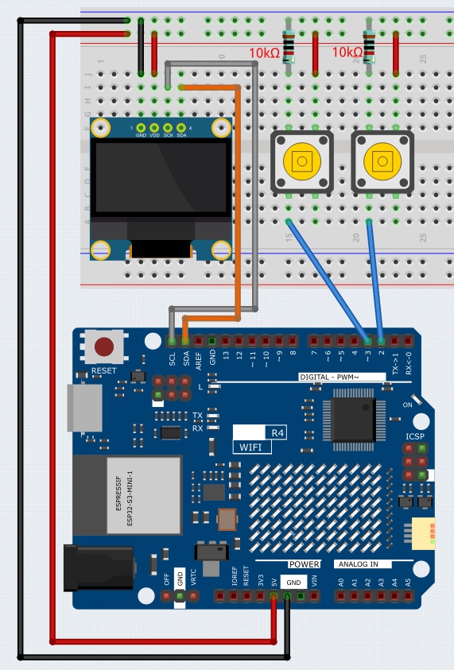

.. _Ext_Ping-Pong_Game:

Ping-Pong Game 
=================================

This is a simple Pong game designed using an OLED display and an Arduino board.
In the Pong game, players compete against the computer, controlling a vertical paddle to bounce back a bouncing ball. 
The goal is to prevent the ball from passing your paddle's edge, or else the opponent scores.

The game mechanics can be divided into the following parts:

1. Ball Movement - The ball moves along its current direction at a set speed. Whenever the ball collides with a paddle, its speed increases, making the game more challenging.

2. Paddle Movement - Used to block the ball's movement, the paddle can move up or down. Players control their own paddle using buttons, while the computer's paddle automatically follows the ball's position.

3. Scoring - Whenever the ball goes beyond the left or right edge of the screen, the corresponding player or CPU scores.

Wiring
----------------

.. note::
    To protect the :ref:`cpn_power`'s battery, please fully charge it before using it for the first time.

**Schematic**

.. 
   .. image:: img/Ping_Pong_Game_Wiring1.png
   :width: 100%
   :align: center

Code
----------------

.. note::

    * You can open the file ``21_Ping_Pong_Game.ino`` under the path of ``Basic-Starter-Kit-for-Arduino-Uno-R4-WiFi-main\Code`` directly.

.. note::
   To install the library, use the Arduino Library Manager and search for **"Adafruit SSD1306"** and **"Adafruit GFX"** and install them.

**How it works?**

Code Explanation
----------------

#. Importing Required Libraries

   Import the ``Adafruit_GFX``, ``Adafruit_SSD1306``, ``SPI``, and ``Wire`` libraries for handling the OLED display and communication.

   .. code-block:: arduino

     #include <Adafruit_GFX.h>
     #include <Adafruit_SSD1306.h>
     #include <SPI.h>
     #include <Wire.h>

#. Configuration and Variable Initialization

   Define display dimensions, button pins, and game variables such as ball and paddle settings.

   .. code-block:: arduino

     #define SCREEN_WIDTH 128
     #define SCREEN_HEIGHT 64
     #define UP_BUTTON 3
     #define DOWN_BUTTON 2
     #define OLED_RESET 4
     const unsigned long BALL_RATE = 80;
     const unsigned long PADDLE_RATE = 33;
     const uint8_t PADDLE_HEIGHT = 16;
     const uint8_t CPU_X = 12;
     const uint8_t PLAYER_X = 115;

#. ``setup()`` Function

   Initialize serial communication, random seed, display, and button pins. Set up initial ball and paddle positions.

   .. code-block:: arduino

     void setup() {
       Serial.begin(115200);
       randomSeed(analogRead(A0));
       display.begin(SSD1306_SWITCHCAPVCC, 0x3C);
       pinMode(UP_BUTTON, INPUT);
       pinMode(DOWN_BUTTON, INPUT);
       drawCourt();
       displayScore();
       ball_update = millis();
       paddle_update = ball_update;
     }

#. ``loop()`` Function

   Main game loop to handle ball movement, paddle updates, and scoring.

   .. code-block:: arduino

     void loop() {
       // Ball and paddle logic
       if (millis() > ball_update) {
         // Ball movement and collision detection
       }
       if (millis() > paddle_update) {
         // Paddle updates
       }
       display.display();
     }

#. ``crossesPlayerPaddle()`` and ``crossesCpuPaddle()`` Functions

   Check if the ball crosses the player or CPU paddle.

   .. code-block:: arduino

     bool crossesPlayerPaddle(uint8_t old_x, uint8_t new_x, uint8_t ball_y) {
       // Check if ball crosses player paddle
     }

     bool crossesCpuPaddle(uint8_t old_x, uint8_t new_x, uint8_t ball_y) {
       // Check if ball crosses CPU paddle
     }

#. ``drawCourt()`` and ``displayScore()`` Functions

   Draw the game court and display the score.

   .. code-block:: arduino

     void drawCourt() {
       display.drawRect(0, 0, SCREEN_WIDTH, SCREEN_HEIGHT, WHITE);
     }

     void displayScore() {
       // Update score display
     }
