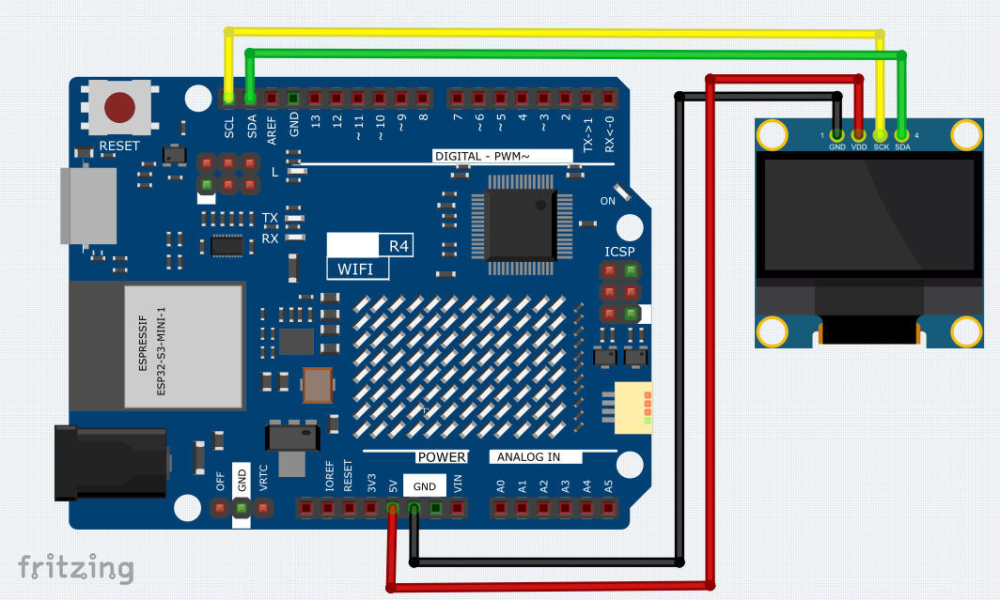
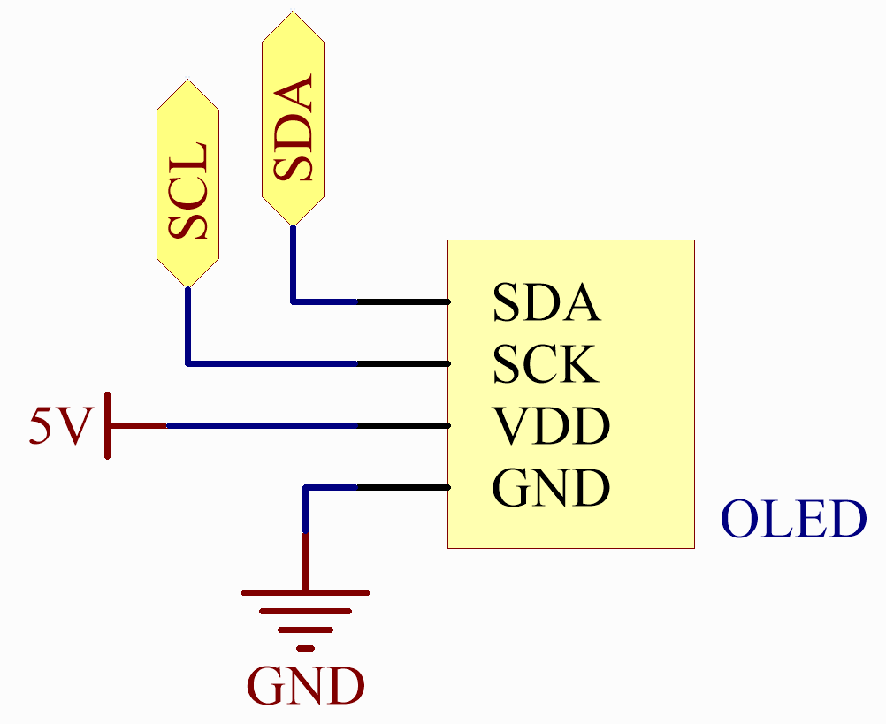
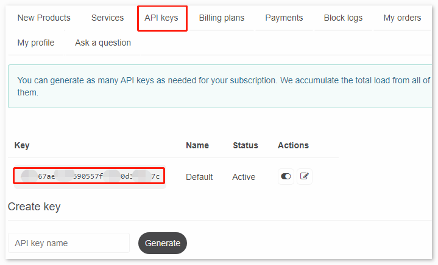

.. _Ext_Real-time_Weather_OLED:

Real-time Weather OLED
===============================

This sketch connects to a WiFi network, fetches weather data from OpenWeatherMap every minute, retrieves the current time from an NTP server, and displays the day, time, and weather information on an OLED screen.

Wiring
---------------------------

**Schematic**

OpenWeather
---------------------------
Get OpenWeather API keys

.. .|link_openweather| is an online service, owned by OpenWeather Ltd, that provides global weather data via API, including current weather data, forecasts, nowcasts and historical weather data for any geographical location.

`OpenWeather <https://openweathermap.org/>`_ is an online service, owned by OpenWeather Ltd, that provides global weather data via API, including current weather data, forecasts, nowcasts and historical weather data for any geographical location.

#. Visit OpenWeather to log in/create an account.

.. image:: img/Real_time_Weather_OLED_Code.png

#. Click into the API page from the navigation bar.

.. image:: img/Real_time_Weather_OLED_Code1.png

#. Find **Current Weather Data** and click Subscribe.

.. image:: img/Real_time_Weather_OLED_Code2.png

#. Under **Current weather and forecasts collection**, subscribe to the appropriate service. In our project, Free is good enough.

.. image:: img/Real_time_Weather_OLED_Code3.png

#. Copy the Key from the **API keys** page.

#. Copy it to the ``arduino_secrets.h`` API_KEY.

   .. code-block:: Arduino

       #define SECRET_SSID "<SSID>"        // your network SSID (name)
       #define SECRET_PASS "<PASSWORD>"        // your network password 
       #define API_KEY "<OpenWeather_API_KEY>"
       #define LOCATION "<YOUR CITY>"

#. Set the time zone of your location.

   Take the capital of United Kingdom, London, as an example. Search "London timezone" on Google.

   .. image:: img/Real_time_Weather_OLED_Code5.png

   In the search results, you will see "GMT+1", so you set the parameter of the function below to ``3600 * 1`` seconds.
   
   .. code-block:: Arduino

      timeClient.setTimeOffset(3600 * 1);  // Adjust for your time zone (this is +1 hour)

Install the Library
---------------------------

To install the library, use the Arduino Library Manager and search for "ArduinoMqttClient", "FastLED", "Adafruit GFX" and "Adafruit SSD1306" and install them.

``ArduinoJson.h``: Used for handling JSON data (data obtained from openweathermap).

``NTPClient.h``: Used for obtaining real-time time.

``Adafruit_GFX.h``, ``Adafruit_SSD1306.h``: Used for OLED module.

Run the Code
---------------------------

.. note::

    * You can open the file ``22_Real_time_Weather_OLED.ino`` under the path of ``Basic-Starter-Kit-for-Arduino-Uno-R4-WiFi-main\Code`` directly.
    * Or copy this code into Arduino IDE.

.. note::
    In the code, SSID and password are stored in ``arduino_secrets.h``. Before uploading this example, you need to modify them with your own WiFi credentials. Additionally, for security purposes, ensure that this information is kept confidential when sharing or storing the code.

How it works?
---------------------------

The code fetches and displays weather information such as temperature, humidity, pressure, and wind details from the OpenWeatherMap API. It connects to a WiFi network, retrieves the current time from an NTP server, and regularly updates the weather data on an OLED screen.

#. Importing Required Libraries

   Import necessary libraries for WiFi, JSON handling, NTP client, and OLED display.

   .. code-block:: arduino

     #include "WiFiS3.h"
     #include <ArduinoJson.h>
     #include <NTPClient.h>
     #include <WiFiUdp.h>
     #include <SPI.h>
     #include <Wire.h>
     #include <Adafruit_GFX.h>
     #include <Adafruit_SSD1306.h>

#. Configuration and Variable Initialization

   Define WiFi credentials, server information, display dimensions, and timing variables.

   .. code-block:: arduino

     #define SCREEN_WIDTH 128
     #define SCREEN_HEIGHT 64
     #define OLED_RESET 4
     char ssid[] = SECRET_SSID;
     char pass[] = SECRET_PASS;
     char server[] = "api.openweathermap.org";
     const unsigned long postingInterval = 60000;

#. ``setup()`` Function

   Initialize serial communication, connect to WiFi, set up the OLED display, and initialize the NTP client.

   .. code-block:: arduino

     void setup() {
       Serial.begin(9600);
       while (!Serial) { ; }
       if (WiFi.status() == WL_NO_MODULE) {
         Serial.println("Communication with WiFi module failed!");
         while (true) { ; }
       }
       String fv = WiFi.firmwareVersion();
       if (fv < WIFI_FIRMWARE_LATEST_VERSION) {
         Serial.println("Please upgrade the firmware");
       }
       while (status != WL_CONNECTED) {
         Serial.print("Attempting to connect to SSID: ");
         Serial.println(ssid);
         status = WiFi.begin(ssid, pass);
         delay(5000);
       }
       printWifiStatus();
       display.begin(SSD1306_SWITCHCAPVCC, 0x3C);
       display.clearDisplay();
       timeClient.begin();
       timeClient.setTimeOffset(3600 * 1);
     }

#. ``loop()`` Function

   Main loop to read weather data and update the display periodically.

   .. code-block:: arduino

     void loop() {
       read_response();
       timeClient.update();
       if (!lastConnectionTime || millis() - lastConnectionTime > postingInterval) {
         httpRequest();
       }
     }

#. Helper Functions

   - ``read_response()``: Parse JSON response and display weather data.
   - ``httpRequest()``: Send HTTP GET request to OpenWeatherMap API.
   - ``printWifiStatus()``: Print WiFi status information.
   - ``displayWeatherData()``: Display weather data on the OLED screen.

   .. code-block:: arduino

     void read_response() {
       // JSON parsing and display logic
     }

     void httpRequest() {
       // HTTP request logic
     }

     void printWifiStatus() {
       // Print WiFi status
     }

     void displayWeatherData(String weather, float temp, int humidity, float pressure, float wind_speed) {
       // Display weather data on OLED
     }
