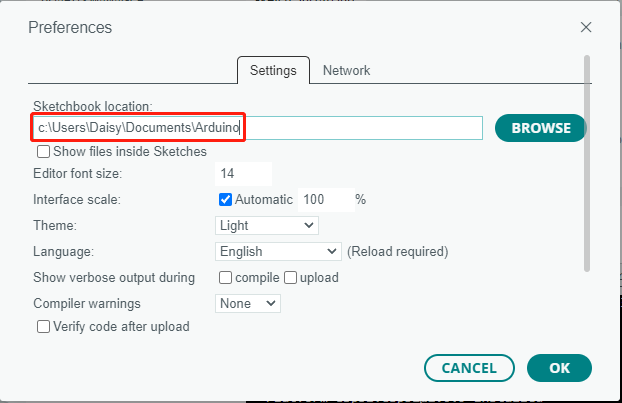

.. _add_libraries:

How to add libraries? (Important)
======================================

A library is a set of pre-written code or functions designed to enhance the functionality of the Arduino IDE. By utilizing libraries, you can easily incorporate complex features into your projects without having to write the code from scratch, thereby saving both time and effort.

Using the Library Manager
-------------------------------

Many libraries are available directly through the Arduino Library Manager. You can access the Library Manager by following these steps:

#. In the **Library Manager**, you can search for the desired library by name or browse through different categories.

   .. note::

      In projects where library installation is required, there will be prompts indicating which libraries to install. Follow the instructions provided, such as "The DHT sensor library library is used here, you can install it from the Library Manager." Simply install the recommended libraries as prompted.

   ..
      image:: img/Library1.png

#. Once you find the library you want to install, click on it and then click the **Install** button.

   ..
      image:: img/Library2.png

#. The Arduino IDE will automatically download and install the library for you.

.. _manual_install_lib:

Manual Installation
-----------------------

Some libraries are not available through the **Library Manager** and need to be manually installed. To install these libraries, follow these steps:

#. Open the Arduino IDE and go to **Sketch** -> **Include Library** -> **Add .ZIP Library**.

   ..
      image:: img/Library3.png

#. Navigate to the directory where the library files are located, such as the ``elite-explorer-kit-main/library/`` folder, and select the library file and click **Open**.

   .. image:: img/Library4.png

#. Once the installation is complete, you will receive a notification confirming that the library has been successfully added to your Arduino IDE. The next time you need to use this library, you won't need to repeat the installation process.

   ..
      image:: img/Library5.png

#. Repeat the same process to add other libraries.

Library Location
-----------------------

The libraries installed using either of the above methods can be found in the default library directory of the Arduino IDE, which is usually located at ``C:\Users\xxx\Documents\Arduino\libraries``.

If your library directory is different, you can check it by going to **File** -> **Preferences**.

**Reference**

* `Installing libraries in Arduino IDE 2 <https://docs.arduino.cc/software/ide-v2/tutorials/ide-v2-installing-a-library>`_